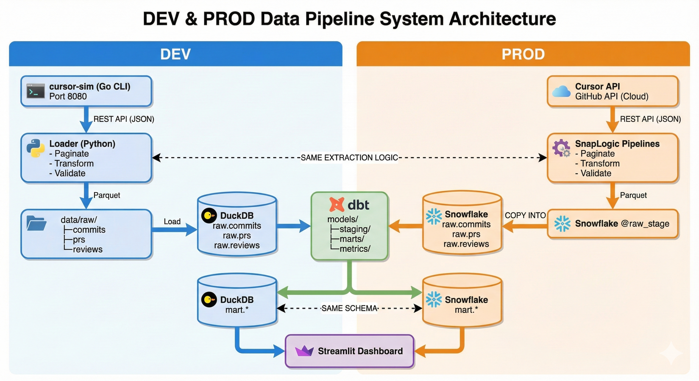

# Dev and Prod Data Pipeline Developer Guide

This guide explains how to use the DEV and PROD data pipeline architecture to
iterate quickly without production IT constraints, while keeping parity with
production behavior and schemas.

## Diagram




## Goal and Core Idea

Build and validate analytics locally (DEV) using the same contracts and dbt
models used in production (PROD). This keeps transformations, schemas, and
metrics consistent, while removing the need to touch SnapLogic or Snowflake
during everyday development.

## DEV and PROD Mapping

DEV path (local, fast):
- cursor-sim (Go CLI on port 8080) provides a stable API contract.
- Python loader paginates, transforms, and validates the API response.
- Parquet files land in `data/raw`.
- DuckDB stores raw tables and dbt builds marts.
- Streamlit reads from DuckDB marts.

PROD path (managed, controlled):
- Cursor API (GitHub API cloud) is the source.
- SnapLogic pipelines paginate, transform, and validate.
- Parquet lands in Snowflake stage, then COPY INTO raw tables.
- dbt runs the same models to produce Snowflake marts.
- Streamlit reads from Snowflake marts.

Parity rules (what keeps DEV and PROD aligned):
- Same extraction logic: loader and SnapLogic should implement identical
  pagination, transform, and validation behavior.
- Same schema: raw fields remain camelCase; dbt staging converts to snake_case.
- Same dbt project: dbt models and tests are shared across targets.

## Quick Start (DEV)

1. Start cursor-sim (or point to an existing staging URL):
```
cd services/cursor-sim
go run ./cmd/simulator -mode runtime -port 8080
```

2. Run the full DEV pipeline:
```
make pipeline
```

3. Query results locally:
```
duckdb data/analytics.duckdb
SELECT * FROM main_mart.mart_velocity LIMIT 10;
```
DuckDB schema names are prefixed by the target schema, so marts live under
`main_mart` by default.

4. Run the Streamlit dashboard (optional):
```
cd services/streamlit-dashboard
streamlit run app.py
```

## Fast Iteration Loop

Use this loop to make changes without production access:
- Edit dbt models in `dbt/models/**` and tests in `dbt/models/**/schema.yml`.
- Rebuild with `make dbt-build` (or `dbt build --target dev`).
- Query DuckDB marts to validate metrics and filters.
- Repeat with smaller windows for speed:
  `START_DATE=7d make pipeline`

## Production Alignment

When you are ready to move changes into production:
- Ensure extraction logic changes are mirrored in SnapLogic.
- Keep raw schemas identical to cursor-sim API responses (camelCase).
- Run dbt on the production target:
  `cd dbt && dbt build --target prod`
- Validate contract tests before promotion:
  `cd dbt && dbt test --target dev`

## Configuration Notes

The pipeline is driven by environment variables in `tools/run_pipeline.sh`:
- `CURSOR_SIM_URL` (default `http://localhost:8080`)
- `API_KEY` (default `cursor-sim-dev-key`)
- `START_DATE` (default `90d`)

## When to Use DEV vs PROD

Use DEV when:
- You are iterating on dbt models, metrics, or dashboard logic.
- You need fast feedback without IT tickets or Snowflake access.
- You want to test contract changes against cursor-sim.

Use PROD when:
- You are ready to release validated changes.
- SnapLogic pipelines must be updated in lock-step with extraction changes.
- You need production data validation or operational monitoring.

## File References

- API contract: `services/cursor-sim/SPEC.md`
- Loader: `tools/api-loader/loader.py`
- DuckDB loader: `tools/api-loader/duckdb_loader.py`
- Parquet output: `data/raw/`
- DuckDB database: `data/analytics.duckdb`
- dbt models: `dbt/models/`
- Streamlit app: `services/streamlit-dashboard/`
